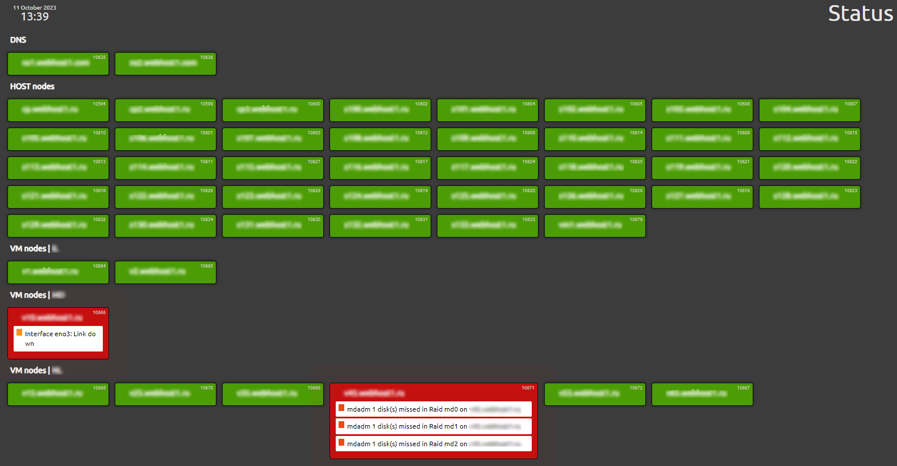

Zabbix-Dashboard 6
================

Simple Dashboard function for Zabbix via the <a href="https://github.com/confirm/PhpZabbixApi">Zabbix php api</a>.

Cloned from https://github.com/incama/Zabbix-Dashboard and updated to work with Zabbix 6.4.

## Screenshot

<strong>Features/requirements:</strong>
<ul>
<li>Gets triggers from hosts which are nested in hostgroups</li>
<li>Need user (within Zabbix) with read only rights</li>
<li>Screens are optimized for 1920px capable monitors</li>
<li>Masonry js library is used to align host blocks tightly</li>
<li>Requires you need create user <u>login</u>, <u>password</u> with read-only rights AND <u>token</u> also created for this user!</li>
<li>Requires <a href="https://github.com/confirm/PhpZabbixApi">Zabbix php api v3.0.0+</a> which is included in this build</li>
<li>Requires PHP 8 or later </li>
</ul>
  
<strong>Host block features:</strong>
<ul>
    <li>Each host block displays a maximum of 3 triggers</li>
    <li>In case of multipe triggers fired on a host, the highest priority trigger will adjust the color and or size of the hostblock</li>
    <li>There are 5 stages defined in which a block is displayed based upon trigger severity</li>
    <li>Triggered host blocks will get the state normal when the trigger state is "OK" (via acknowledgment of trigger or threshold level is normal)</li>
</ul>

I have tested the dashboard on Zabbix 6.4 but I think it will work fine in 6.x later, although you might need a newer php api version (maybe).
Since we use the Zabbix php api, which is installed via composer, all license and component files are included in this repository and are located in the vendor directory.
